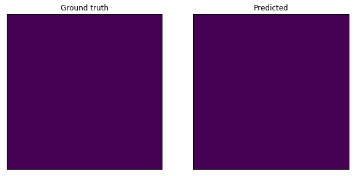
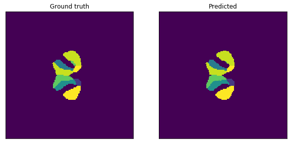
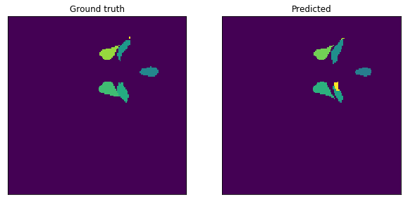
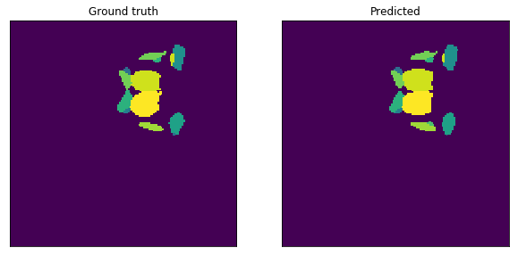
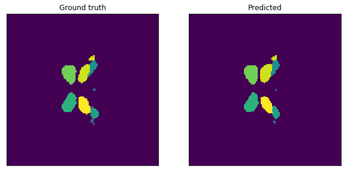
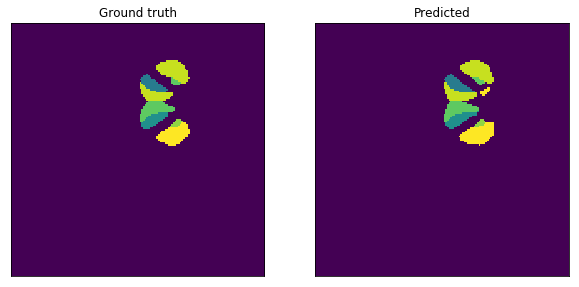

# M-Net
M-NET model for deep brain structure segmentation
This project is re-implementation of M-NET paper: https://ieeexplore.ieee.org/stamp/stamp.jsp?arnumber=7950555

## Brief Overview:
M-NET is an end-to-end trainable Convolutional Neural Network (CNN) architecture, for segmenting deep (human) brain structures from Magnetic Resonance Images (MRI). A novel scheme is used to learn to combine and represent 3D context information of a given slice in a 2D slice. Consequently, the M-net utilizes only 2D convolution though it operates on 3D data, which makes M-net
memory efficient. 

### Results:
<b>Training F1-Score:</b> 0.90, <b>Standard-deviation:</b> 0.013  
<b>Test F1-Score:</b> 0.84  
Below are the ground-truth vs predicted segementations:

